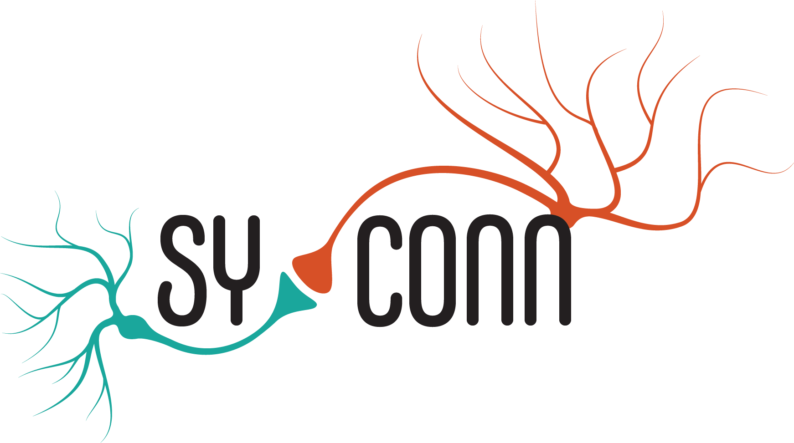

<br/>
[](https://syconn.readthedocs.io/en/latest/?badge=latest)
[](https://gitlab.mpcdf.mpg.de/pschuber/SyConn/commits/master)
[](https://gitlab.mpcdf.mpg.de/pschuber/SyConn/commits/master)
[](https://gitlab.mpcdf.mpg.de/pschuber/SyConn/-/jobs/artifacts/master/raw/pylint/pylint.log?job=pylint)

SyConn2
------
Connectomic analysis toolkit for automated synaptic connectivity inference based on dense EM segmentation data.

Current features:
- interface to supervoxel properties for various types (e.g. cell fragments, synapses, mitochondria, vesicle clouds, ..) and entire cell reconstructions 
(associated cell objects, mesh, skeleton, prediction results, ..)
- (sub-) cellular compartment (spines, boutons and axon/dendrite/soma) and cell type classification with multiview- [\[2\]](https://www.nature.com/articles/s41467-019-10836-3) and with skeleton-based approaches [\[1\]](https://www.nature.com/articles/nmeth.4206)
- distributed parallelization (SLURM, QSUB) of all processing steps
- astrocyte identification and separation [\[2\]](https://www.nature.com/articles/s41467-019-10836-3)
- neuroglancer web interface

If you use parts of this code base in your academic projects, please cite the corresponding publication(s).

To access v1 of SyConn 
please checkout the branch [dorkenwald2017nm](https://github.com/StructuralNeurobiologyLab/SyConn/tree/dorkenwald2017nm) or have a look at 
the [documentation](https://structuralneurobiologylab.github.io/SyConn/documentation/). 
We also present more general information about SyConn on our [Website](https://structuralneurobiologylab.github.io/SyConn/).

Documentation
-------------
The documentation including API docs can be found as [readthedocs build](https://syconn.readthedocs.io/en/latest/) or partially as markdown [here](docs/doc.md).

The Team
--------
The Synaptic connectivity inference toolkit is currently developed at the Max-Planck-Institute of Neurobiology in Martinsried by
 Philipp Schubert, Jonathan Klimesch, Alexandra Rother and Joergen Kornfeld.
Big thanks to Filippo Kiessler, David Outland, Santiago Aguirre, Hashir Ahmad, Andrei Mancu, Rangoli Saxena, Mariana Shumliakivska,
Josef Mark, Maria Kawula, Atul Mohite, Carl Constantin v. Wedemeyer,
Gaurav Kumar and Martin Drawitsch for code contributions.

Acknowledgements
----------------
We are especially grateful for the support by Winfried Denk who enabled
this work in his department. We also want to thank Christian
Guggenberger and his group at the MPCDF for cluster support and deepmind
for providing egl extension code to handle multi-gpu rendering on the
same machine. The original code snippet (under the Apache License 2.0)
used for our project can be found
[here](https://github.com/deepmind/dm_control/blob/30069ac11b60ee71acbd9159547d0bc334d63281/dm_control/_render/pyopengl/egl_ext.py).
SyConn uses the packages [zmesh](https://github.com/seung-lab/zmesh) for mesh and [kimimaro](https://github.com/seung-lab/kimimaro)
for skeleton generation implemented and developed in the Seung Lab.
Thanks to Julia Kuhl (see http://somedonkey.com/ for more beautiful
work) for designing and creating the logo!


Publications
------------
\[1\] [Automated synaptic connectivity inference for volume electron microscopy](https://www.nature.com/articles/nmeth.4206)
```
 @ARTICLE{SyConn2017,
   title     = "Automated synaptic connectivity inference for volume electron
                microscopy",
   author    = "Dorkenwald, Sven and Schubert, Philipp J and Killinger, Marius F
                and Urban, Gregor and Mikula, Shawn and Svara, Fabian and
                Kornfeld, Joergen",
   abstract  = "SyConn is a computational framework that infers the synaptic
                wiring of neurons in volume electron microscopy data sets with
                machine learning. It has been applied to zebra finch, mouse and
                zebrafish neuronal tissue samples.",
   journal   = "Nat. Methods",
   publisher = "Nature Publishing Group, a division of Macmillan Publishers Limited. All Rights Reserved.",
   year      = 2017,
   month     = Feb,
   day       = 27,
   url       = http://dx.doi.org/10.1038/nmeth.4206
 }
  ```

\[2\] [Learning cellular morphology with neural networks](https://doi.org/10.1038/s41467-019-10836-3)
  ```
  @Article{Schubert2019,
author={Schubert, Philipp J.
and Dorkenwald, Sven
and Januszewski, Michal
and Jain, Viren
and Kornfeld, Joergen},
title={Learning cellular morphology with neural networks},
journal={Nature Communications},
year={2019},
volume={10},
number={1},
pages={2736},
abstract={Reconstruction and annotation of volume electron microscopy data sets of brain tissue is challenging but
can reveal invaluable information about neuronal circuits. Significant progress has recently been made in automated
neuron reconstruction as well as automated detection of synapses. However, methods for automating the morphological
analysis of nanometer-resolution reconstructions are less established, despite the diversity of possible applications.
Here, we introduce cellular morphology neural networks (CMNs), based on multi-view projections sampled from automatically
reconstructed cellular fragments of arbitrary size and shape. Using unsupervised training, we infer morphology embeddings
(Neuron2vec) of neuron reconstructions and train CMNs to identify glia cells in a supervised classification paradigm,
which are then used to resolve neuron reconstruction errors. Finally, we demonstrate that CMNs can be used to identify
subcellular compartments and the cell types of neuron reconstructions.},
issn={2041-1723},
doi={10.1038/s41467-019-10836-3},
url={https://doi.org/10.1038/s41467-019-10836-3}
}
  ```
