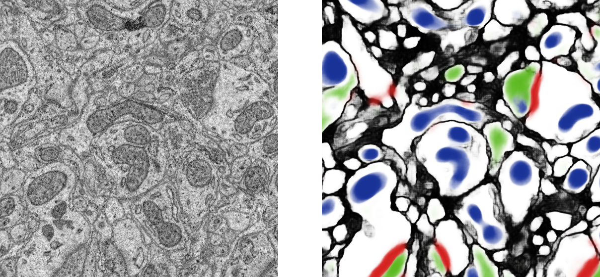
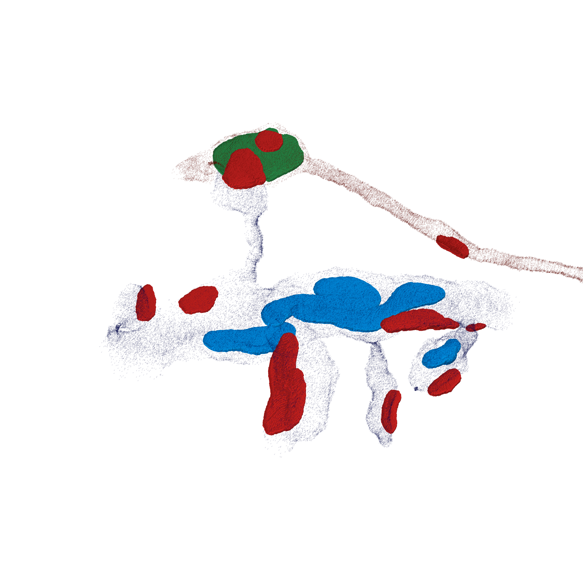
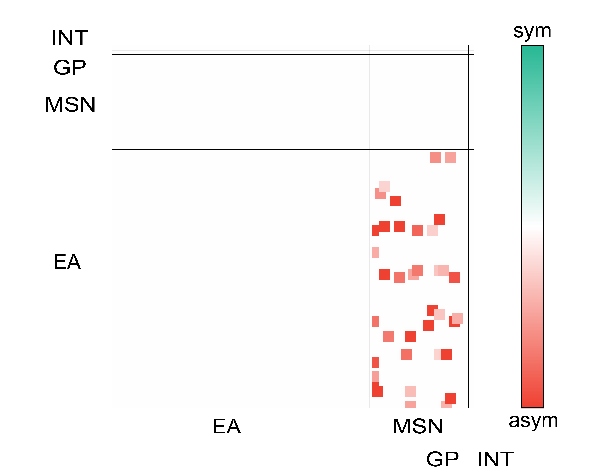

.. _examples:

********
Examples
********

This page gives an example for a full run of  then main components of SyConn.
The corresponding code is available in :ref:`/syconn/main.py`.
The example data set with all pre-trained models can be downloaded at
`to be added <http://>`_.

Data Set
--------
This data set is a subset of the zebra finch area X dataset j0126 by
`Jörgen Kornfeld <http://www.neuro.mpg.de/mitarbeiter/43611/3242756>`_.

.. figure::  images/raw_cube_tracings.png
   :scale:   60 %
   :align:   center

   Left: Raw data cube Right: Human cell tracings

The above figure shows cell tracings in 3D EM data cube, which is the
required data to perform automated structural analysis using SyConn.
The following section is a walk-through of all major steps.

Applying SyConn -- step by step
-------------------------------
At first, membrane and intracellular space is predicted as barrier (black) and cell
components, such as mitochondria (blue), vesicle clouds (green) and synaptic junctions (red)
are detected as objects using a CNN with a 3D perceptive field of view and an
object extraction afterwards, see figure below.

   Left: Slice of the raw cube Right: Resulting CNN predictions

Based on the cell tracings and the barrier prediction a cell hull sampling
is performed which enables mapping components to individual cells (embedding
tracings in biological environment). Furthermore, contact sites of adjacent
cell pairs can be distinguished from synapses combining properties of corresponding
contact site and, if existent, synaptic junction.

With these priors sub-cellular compartments can be inferred (axon/dendrite/soma and spines in dendrites)
to further assign types (EA, MSN, GP, INT) to every cell and create a wiring
diagram combining knowledge about pre and post synapses (sub-cellular compartments),
area of synaptic junctions and cell functions.

