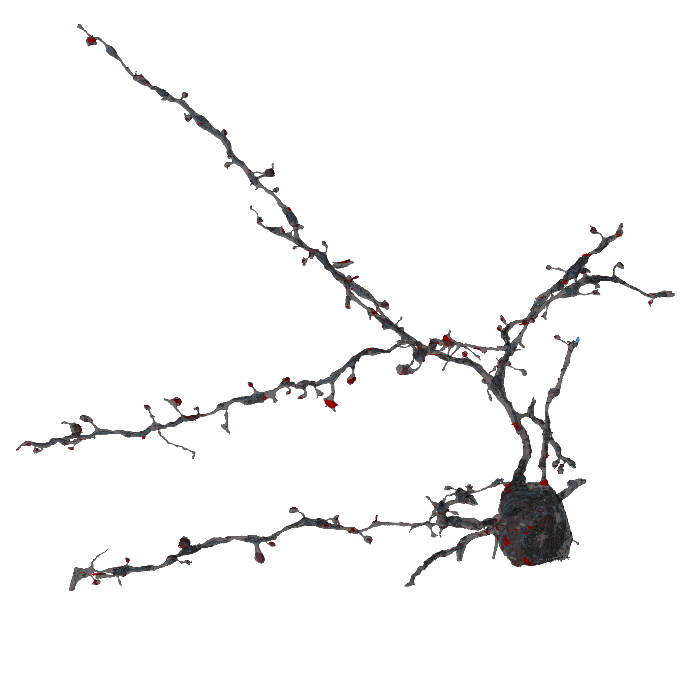
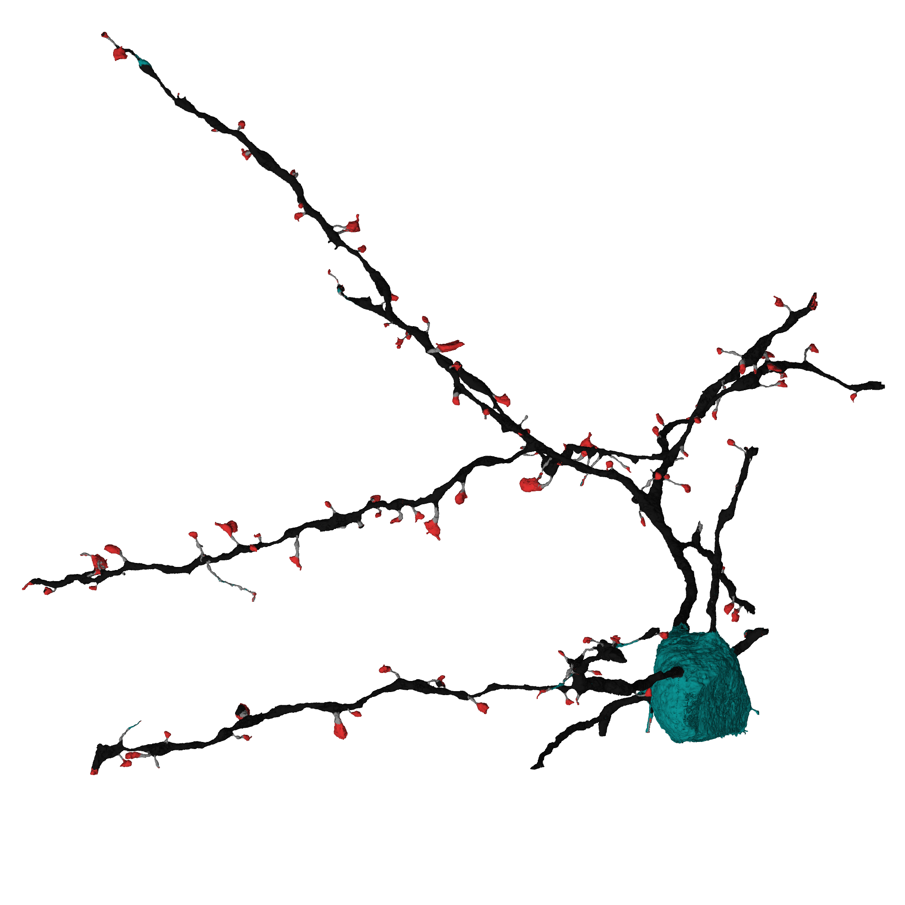

# Examples [WIP]

Example scripts (`SyConn/examples/`) for processing 3D electron
microscope (EM) data. Example data are available upon request.


## The example data content
The folder contains an exemplary 3D EM data.
One dataset can be provided upon request: cube1 of size 400 x 400 x 600
* `data1` contains:
    * h5 files that store raw data (`raw.h5`) and
    segmentation information about cells (`seg.h5`) and other cellular
    organelles like mitochondria (`mi.h5`), synaptic junctions (`sj.h5`),
    vesicle clouds (`vc.h5`), symmetric and asymmetric synapses (`sym.h5` and
    `asym.h5`, respectively). Each cell and cell component has its id greater than zero.
    The id of the background (membranes and intracellular spaces) is 0.
    * `rag.bz2` and `neuron_rag.bz2` files contain lists of edges of
    Resource Allocation Graph (RAG) that describes the neurons structure.
* `models`- folder with pretrained Convolutional Neural Network models
  to detect cell types, glia, myelins, spines, synapses types etc.


## Prerequisites
The following data should be located in in the current directory when executing
`start.py`, they will be copied to the `working_directory` if they are not
there yet:
* models
* data1


## Command line arguments
* `--working_dir`- can be given as a command line argument or defined
by the user inside the script.
* `--example_cube`- integer: 1


## Basic parameters
* `scale` numpy array; voxel size in nano meters
* `prior_astrocyte_removal` boolean
* `chunk_size` touple; size of a cube that is processed by a single worker
* `n_folders_fs` and `n_folders_fs_sc` number of folders in the folder structure
to create a hierarchy for storing information about cells and subcellular elements
* `experiment_name`; string
* Each working directory has its own `config.yml` file that stores dataset
specific parameters (for more detailed information see [config](config.md)).
To add further parameters to the `config.yml` file, they have to be specified
in the `key_val_pairs_conf` list of tuples, here:
    * `pyopengl_platform`: string, possible 'egl' ...
    * `batch_proc_system`: string, possible 'SLURM',...
    * `prior_astrocyte_removal`: boolean
    * `ncores_per_node`, `ngpus_per_node`, `nnodes_total`: intigers

* `bb` numpy array; min and max coordinates of the cube of interest will
be fetched from the annotation file;
* `offset` numpy array
* `bd` numpy array; effectively dimensions of the cube of interest


## Logging
For the example run a convenient system of log files is provided.
There is created one main log file for the whole run and other for
subsequent steps of the pipeline.
All log files are located in `log` folder inside working directory.


## Initialize data
Data in the form of h5 files have to be converted into knossos datasets.
For more information about knossos data format check [KNOSSOS](http://knossostool.org/)


## Start SyConn
Data processing is divided into nine steps that have to be run subsequently.


## Remark

The transform functions will be applied when loading the segmentation
data of cell organelles in order to convert them into binary fore- and
background currently using `dill` package to support lambda expressions.
Make sure all dependencies within the lambda expressions are imported
in `batchjob_object_segmentation.py` (here: numpy).


# Prediction examples

This section introduces minimal examples for parts of SyConn. The corresponding python scripts
can be found in `SyConn/examples/`.

## Semantic segmentation of spines
* python script:  `SyConn/examples/semseg_spine.py`
* requires model folder in working directory





The script needs to be called with at least the `--kzip` argument to specify the location of the
 file which contains the cell reconstruction.
If your SyConn working directory of example cube 1 is not located at the default
location (`~/SyConn/example_cube1/`) the path to the parent directory of SyConn's `models` folder
 has to be specified via the `--working_dir` argument.

To run the script on a k.zip file (filename should contain at least of numeric value, e.g. `1_spineexample.k.zip`) execute the
 following:

```
python SyConn/examples/semseg_spine.py --kzip=~/1_spineexample.k.zip
```

The k.zip file must contain mesh files of the cell, its synaptic junctions, mitochondria and vesicle clouds: `sv.ply`, `sj.ply`, `mi.ply`, `vc.ply`.

After completion you will find a second file which contains the cell mesh colored according to the
model's output.

The following two images show an example of the original data (content of `1_spineexample.k.zip`) and the prediction (content of `1_spineexample_spines.k.zip`; red: spine head, black: dendritic shaft; grey: spine neck; turquoise: soma/axon)


## Semantic segmentation of axons, dendrites and somas
* python script:  `SyConn/examples/semseg_axon.py`
* requires model folder in working directory

```
python SyConn/examples/semseg_axon.py --kzip=~/2_axonexample.k.zip
```
