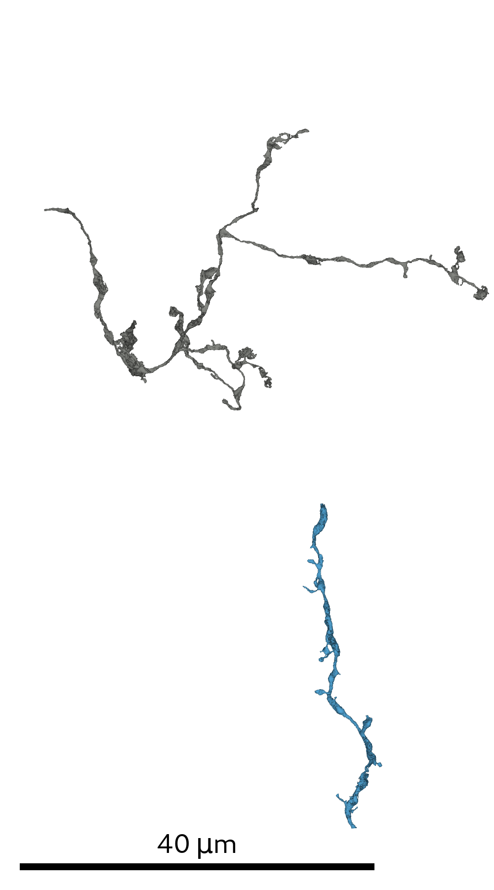
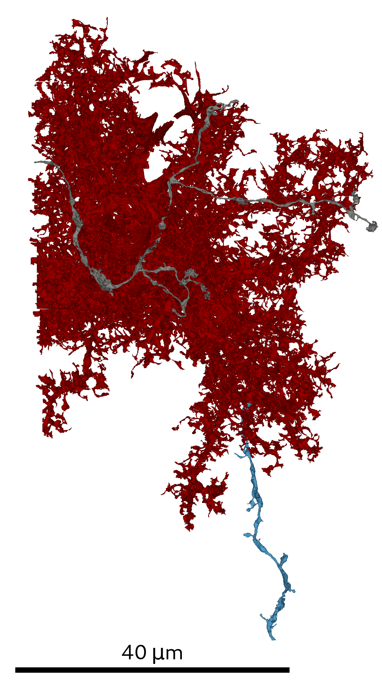

# Glia removal
All scripts used for the analysis of the neuron segmentation are located in `SyConn/scripts/multiviews_glia/`.

## Prerequisites
* Knossos- and SegmentationDataset of the supervoxel segmentation
* Initial RAG/SV-mapping

## Steps

In order to generate the SSV multi-views prior to glia removal it is necessary to provide the script with an initial RAG/SV-mapping.
The agglomerated SVs are required to provide sufficient context for the glia prediction:

    start_sso_rendering_glia_removal.py

In order to start the glia prediction run:

    glia_prediction.py

SVs with predicted glia labels will be removed via a splitting heuristic. For splitting and generating
 the glia-free region adjacency graph (RAG) run:

    glia_splitting.py

## Preparing neuron analysis
Now create a new SSD, the post-glia-removal SSD, from the resulting RAG and run a
 dataset analysis to assign cell objects (mitochondria, vesicle clouds and synaptic junctions)
 to all its SSVs (see [SSD](super_segmentation_datasets.md)).
