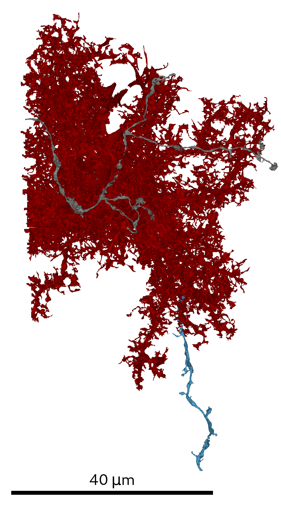
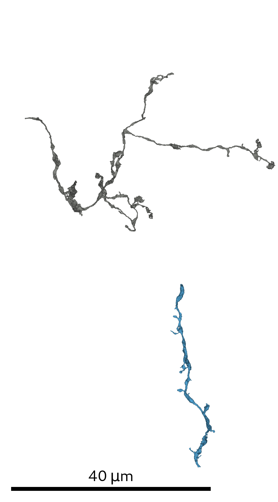

# Glia removal
All scripts used for the analysis of the neuron segmentation are located in `SyConn/scripts/multiviews_glia/`.

## Prerequisites
* Knossos- and SegmentationDataset of the super voxel segmentation
* Initial RAG/SV-mapping

## Steps
For generating the multi-views prior to glia removal run:
`start_sso_rendering_glia_removal.py`

It is necessary to provide the script with an initial RAG/SV-mapping.
The definitions of the agglomerated SVs are used as context for the glia prediction.
In order to start the glia prediction run:
`glia_prediction.py`

SVs with predicted glia labels will be removed via a splitting heuristic.
For splitting and generating the glia-free region adjacency graph (RAG) run:
`glia_splitting.py`

## Preparing neuron analysis
Now create a new SSD, the post-glia-removal SSD, from the resulting RAG and run a
 dataset analysis to assign cell objects (mitochondria, vesicle clouds and synaptic junctions)
 to all its SSVs (see [SSD](super_segmentation_datasets.md))
