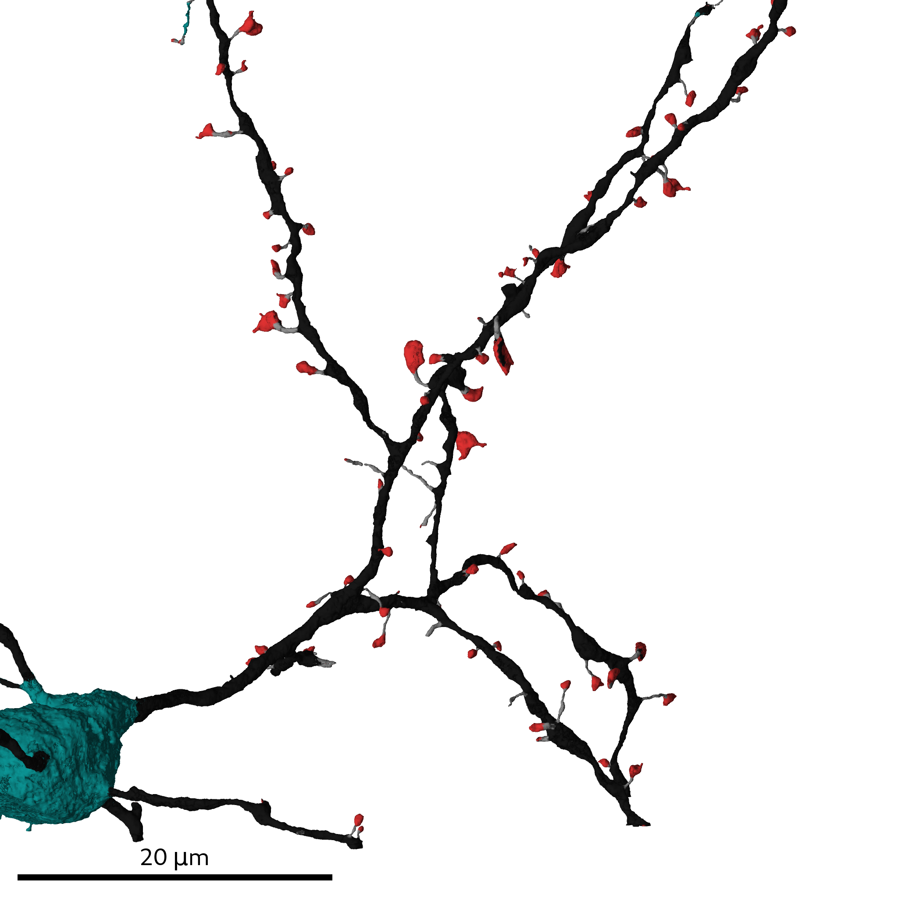
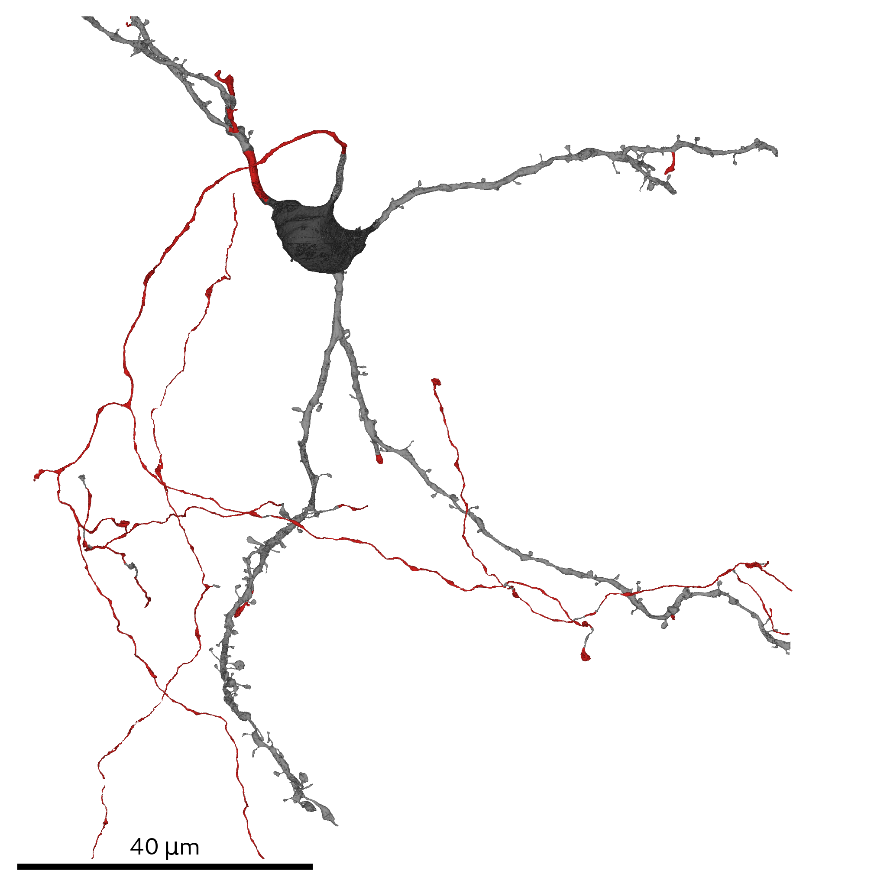

# Neuronal morphology analysis and classification
All scripts used for the analysis of the neuron segmentation are located in `SyConn/scripts/multiviews_neuron/`, namely:
* SSV multi-views generation: `start_sso_rendering.py`
* Cell compartment prediction: `axoness_prediction.py` and `spiness_prediction.py`
* Cell type prediction: `celltype_prediction.py`

## Prerequisites
* Knossos- and SegmentationDataset of the super voxel segmentation
* SegmentationDatasets for all cellular organelles (currently mitochondria, vesicle clouds and synaptic junctions)
* \[Optional\] [Glia removal](glia_removal.md)
* The RAG/SV-mapping in form of a SSD, see [SuperSegmentationDatasets](super_segmentation_datasets.md)
* [Mapped cellular organelles](object_mapping.md) to SSVs

## Steps

The multi-views contain shape information of cellular organelles and the cell/SSV outline
and are the basis for predicting cell compartments, cell type and spines. To generate them dataset-wide run:

    start_sso_rendering.py

Dataset-wide predictions can be started via the respective scripts:
* Cell compartments: `axoness_prediction.py` and `spiness_prediction.py`
* Cell types: `celltype_prediction.py`

Their results are stored on SSV level and used for [extracting the wiring diagram](contact_size_classification.md) later on.
